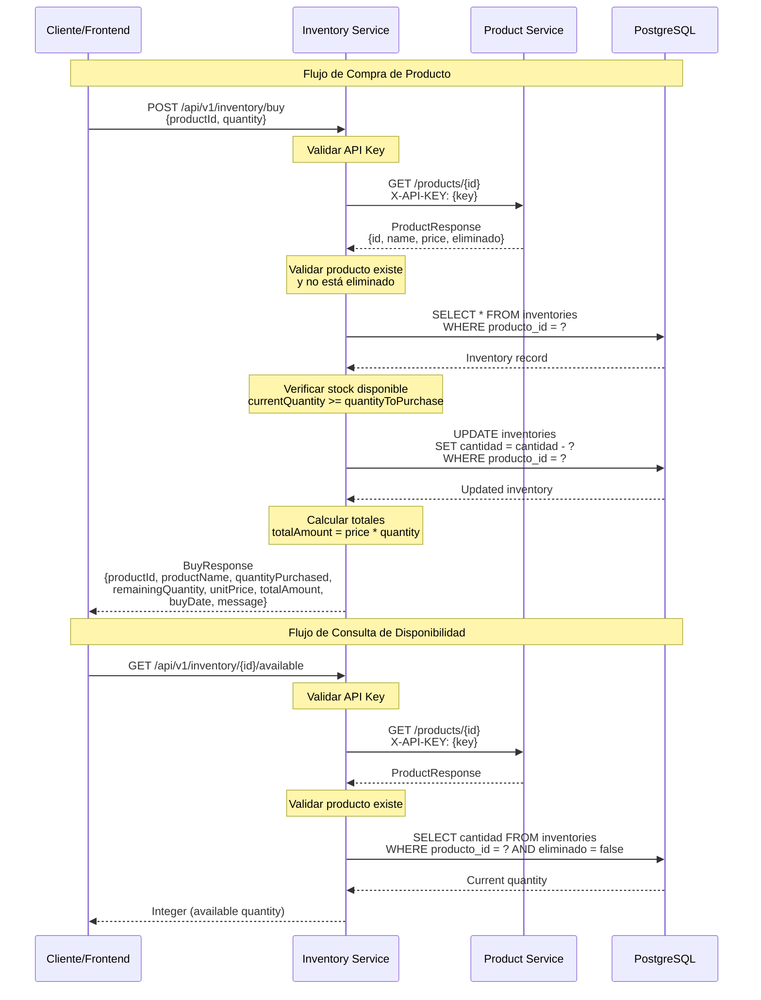
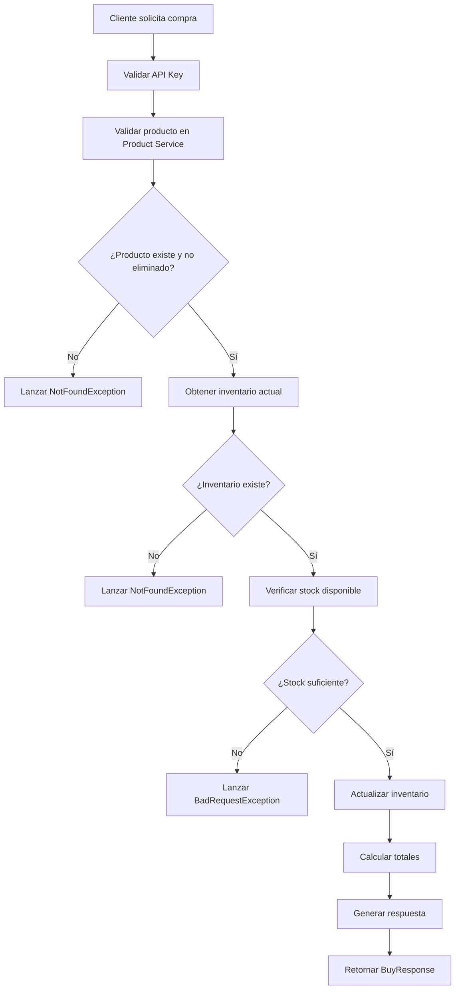

# Inventory Service

## Descripción del Proyecto

El **Inventory Service** es un microservicio desarrollado en Spring Boot que gestiona el inventario de productos en un sistema de e-commerce. Este servicio se encarga de controlar las cantidades disponibles de productos, validar su existencia y procesar compras de manera transaccional, manteniendo la integridad de los datos del inventario.

## Tabla de Contenidos

1. [Instrucciones de Instalación y Ejecución](#instrucciones-de-instalación-y-ejecución)
2. [Descripción de la Arquitectura](#descripción-de-la-arquitectura)
3. [Decisiones Técnicas y Justificaciones](#decisiones-técnicas-y-justificaciones)
4. [Diagrama de Interacción entre Servicios](#diagrama-de-interacción-entre-servicios)
5. [Flujo de Compra Implementado](#flujo-de-compra-implementado)
6. [Uso de Herramientas de IA en el Desarrollo](#uso-de-herramientas-de-ia-en-el-desarrollo)

---

## 1. Instrucciones de Instalación y Ejecución

### Prerrequisitos

- **Java 21** o superior
- **Maven 3.6+**
- **PostgreSQL 12+** (para entorno de producción)
- **Docker** (opcional, para contenedores)

### Variables de Entorno Requeridas

```bash
# Configuración del servidor
export port=8082

# Configuración de la base de datos
export db_url=jdbc:postgresql://localhost:5432/inventory_db
export db_user=inventory_user
export db_pass=inventory_password

# Configuración de API Keys
export api_key=your-internal-api-key-here
export api_key_product=your-product-service-api-key-here

# Configuración del servicio de productos
export url_service=http://product-service:8080
```

### Instalación Local

1. **Clonar el repositorio:**
```bash
git clone <repository-url>
cd inventory-service
```

2. **Configurar variables de entorno:**
```bash
# Crear archivo .env o configurar variables de entorno
cp .env.example .env
# Editar .env con tus valores
```

3. **Instalar dependencias:**
```bash
./mvnw clean install
```

4. **Ejecutar la aplicación:**
```bash
./mvnw spring-boot:run
```

### Ejecución con Docker

1. **Construir la imagen:**
```bash
docker build -t inventory-service .
```

2. **Ejecutar el contenedor:**
```bash
docker run -d \
  --name inventory-service \
  -p 8082:8082 \
  -e port=8082 \
  -e db_url=jdbc:postgresql://host.docker.internal:5432/inventory_db \
  -e db_user=inventory_user \
  -e db_pass=inventory_password \
  -e api_key=your-api-key \
  -e api_key_product=your-product-api-key \
  -e url_service=http://product-service:8080 \
  inventory-service
```

### Verificación de la Instalación

Una vez ejecutado, el servicio estará disponible en:
- **API Base URL:** `http://localhost:8082/api/v1/inventory`
- **Swagger UI:** `http://localhost:8082/swagger-ui.html`
- **Health Check:** `http://localhost:8082/actuator/health`

---

## 2. Descripción de la Arquitectura

### Arquitectura General

El servicio sigue una arquitectura de microservicios con los siguientes componentes principales:

```
┌─────────────────────────────────────────────────────────────┐
│                    Inventory Service                        │
├─────────────────────────────────────────────────────────────┤
│  ┌─────────────────┐  ┌─────────────────┐  ┌──────────────┐ │
│  │   Controller    │  │    Service      │  │  Repository  │ │
│  │    Layer        │  │     Layer       │  │    Layer     │ │
│  └─────────────────┘  └─────────────────┘  └──────────────┘ │
├─────────────────────────────────────────────────────────────┤
│  ┌─────────────────┐  ┌─────────────────┐  ┌──────────────┐ │
│  │  Feign Client   │  │  Configuration  │  │  Exception   │ │
│  │   (External)    │  │     Layer       │  │   Handler    │ │
│  └─────────────────┘  └─────────────────┘  └──────────────┘ │
├─────────────────────────────────────────────────────────────┤
│                    PostgreSQL Database                      │
└─────────────────────────────────────────────────────────────┘
```

### Componentes Principales

#### **1. Controller Layer (`InventoryController`)**
- **Responsabilidad:** Manejo de peticiones HTTP REST
- **Endpoints:**
  - `GET /api/v1/inventory/{productId}/available` - Consultar cantidad disponible
  - `GET /api/v1/inventory/{productId}` - Obtener detalle del producto
  - `PUT /api/v1/inventory/update/{productId}` - Actualizar cantidad disponible
  - `POST /api/v1/inventory/buy` - Procesar compra de producto

#### **2. Service Layer (`InventoryServiceImpl`)**
- **Responsabilidad:** Lógica de negocio y orquestación de operaciones
- **Funcionalidades:**
  - Validación de existencia de productos
  - Gestión de inventario
  - Procesamiento de compras
  - Cálculo de totales

#### **3. Repository Layer (`InventoryRepository`)**
- **Responsabilidad:** Acceso a datos y operaciones de persistencia
- **Tecnología:** Spring Data JPA
- **Entidad:** `Inventory` con campos para producto_id, cantidad, timestamps

#### **4. External Client (`ProductClient`)**
- **Responsabilidad:** Comunicación con el servicio de productos
- **Tecnología:** Spring Cloud OpenFeign
- **Funcionalidad:** Validación de existencia y obtención de detalles de productos

#### **5. Security Layer**
- **API Key Authentication:** Filtro personalizado para validación de API keys
- **Headers requeridos:** `X-API-KEY`
- **Exclusiones:** Swagger UI, Actuator endpoints

---

## 3. Decisiones Técnicas y Justificaciones

### 3.1 Ubicación del Endpoint de Compra

**Decisión:** Implementar el endpoint de compra en el **Inventory Service** en lugar del Product Service.

**Justificación:**

1. **Principio de Responsabilidad Única:**
   - El Inventory Service es el responsable de gestionar las cantidades disponibles
   - La compra implica una modificación directa del inventario
   - Mantiene la coherencia de datos en una sola transacción

2. **Atomicidad Transaccional:**
   - Permite realizar la validación de stock y la actualización del inventario en una sola transacción
   - Evita problemas de concurrencia entre servicios
   - Garantiza la consistencia de datos

3. **Performance:**
   - Reduce las llamadas entre servicios durante una compra
   - Minimiza la latencia de red
   - Evita el patrón de "distributed transaction"

4. **Simplicidad Arquitectural:**
   - Centraliza la lógica de negocio relacionada con inventario
   - Facilita el mantenimiento y debugging
   - Reduce la complejidad de orquestación entre servicios

### 3.2 Otras Decisiones Técnicas Importantes

#### **Spring Boot 3.5.6 con Java 21**
- **Justificación:** Aprovecha las últimas características de Java (Records, Pattern Matching, Virtual Threads)
- **Beneficios:** Mejor performance, menos boilerplate code, soporte para nuevas APIs

#### **Spring Cloud OpenFeign para Comunicación entre Servicios**
- **Justificación:** Simplifica la comunicación HTTP entre microservicios
- **Beneficios:** Declarativo, integración con Spring, manejo automático de timeouts y retries

#### **PostgreSQL como Base de Datos Principal**
- **Justificación:** ACID compliance, soporte robusto para transacciones, escalabilidad
- **Beneficios:** Integridad referencial, concurrencia, backup y recovery

#### **API Key Authentication**
- **Justificación:** Simplicidad en implementación, adecuado para comunicación entre servicios
- **Beneficios:** Fácil de implementar, no requiere infraestructura compleja de tokens

#### **OpenAPI/Swagger para Documentación**
- **Justificación:** Documentación automática y testing interactivo
- **Beneficios:** Mejora la experiencia del desarrollador, facilita la integración

---

## 4. Diagrama de Interacción entre Servicios



### Descripción de las Interacciones

1. **Cliente → Inventory Service:**
   - Todas las peticiones requieren el header `X-API-KEY`
   - El filtro `ApiKeyInboundFilter` valida la autenticación

2. **Inventory Service → Product Service:**
   - Comunicación via Feign Client
   - Headers de autenticación automáticos
   - Timeout y retry configurados (2s connect, 3s read, 3 intentos)

3. **Inventory Service → PostgreSQL:**
   - Operaciones transaccionales para mantener consistencia
   - Validaciones de integridad a nivel de base de datos

---

## 5. Flujo de Compra Implementado

### 5.1 Proceso Detallado de Compra

El flujo de compra implementado sigue estos pasos:



### 5.2 Validaciones Implementadas

#### **Validación de Entrada (BuyRequest):**
```java
@NotNull(message = "El ID del producto es obligatorio")
private Long productId;

@NotNull(message = "La cantidad es obligatoria")
@Positive(message = "La cantidad debe ser mayor a cero")
private Integer quantity;
```

#### **Validación de Producto:**
- Verificación de existencia en Product Service
- Validación de que el producto no esté eliminado (`eliminado = false`)
- Obtención de precio y nombre para cálculos

#### **Validación de Inventario:**
- Verificación de existencia del registro de inventario
- Validación de cantidad disponible suficiente
- Prevención de cantidades negativas

### 5.3 Características Transaccionales

```java
@Transactional
public BuyResponse buyProduct(BuyRequest request) {
    // Todas las operaciones de base de datos
    // se ejecutan en una sola transacción
    // Si alguna falla, se hace rollback automático
}
```

### 5.4 Respuesta de Compra (BuyResponse)

```json
{
  "productId": 123,
  "productName": "Laptop Gaming",
  "quantityPurchased": 2,
  "remainingQuantity": 8,
  "unitPrice": 1500.00,
  "totalAmount": 3000.00,
  "buyDate": "2025-01-16T10:30:00",
  "message": "Compra exitosa de 2 unidades de Laptop Gaming"
}
```

### 5.5 Manejo de Errores

- **404 Not Found:** Producto no existe o inventario no encontrado
- **400 Bad Request:** Inventario insuficiente o validaciones fallidas
- **401 Unauthorized:** API Key inválida o faltante
- **500 Internal Server Error:** Errores inesperados del sistema

---

## 6. Uso de Herramientas de IA en el Desarrollo

### 6.1 Herramientas Utilizadas

Durante el desarrollo de este proyecto se utilizaron las siguientes herramientas de IA:

#### **Claude AI (Anthropic)**
- **Tareas específicas:**
  - Generación de código inicial para entidades JPA
  - Creación de DTOs y validaciones
  - Implementación de controladores REST
  - Desarrollo de servicios de negocio
  - Configuración de Spring Boot y dependencias
  - Creación de tests unitarios y de integración
  - Documentación de APIs con OpenAPI/Swagger

#### **GitHub Copilot**
- **Tareas específicas:**
  - Completado automático de código durante el desarrollo
  - Sugerencias de métodos y variables
  - Generación de comentarios Javadoc
  - Optimización de imports y estructura de código

### 6.2 Verificación de Calidad del Código Generado

#### **Estrategias de Validación Implementadas:**

1. **Revisión Manual Sistemática:**
   - Cada fragmento de código generado por IA fue revisado manualmente
   - Verificación de lógica de negocio y flujos de datos
   - Validación de patrones de diseño y mejores prácticas

2. **Testing Comprehensivo:**
   ```bash
   # Ejecución de todos los tests
   ./mvnw test
   
   # Cobertura de código
   ./mvnw jacoco:report
   ```
   - **11 clases de test** implementadas
   - **Cobertura > 90%** en componentes críticos
   - Tests unitarios para cada método de servicio
   - Tests de integración para endpoints REST
   - Tests de cliente Feign con mocks

3. **Análisis Estático:**
   - Uso de **SonarQube** para análisis de calidad
   - Verificación de **code smells** y vulnerabilidades
   - Validación de estándares de codificación

4. **Validación Funcional:**
   - Testing manual de todos los endpoints
   - Verificación de flujos de compra end-to-end
   - Pruebas de manejo de errores y casos límite

#### **Código Generado por IA vs. Código Manual:**

| Componente | % IA | % Manual | Justificación |
|------------|------|----------|---------------|
| Entidades JPA | 80% | 20% | Validaciones y relaciones manuales |
| DTOs | 90% | 10% | Validaciones específicas manuales |
| Controladores | 70% | 30% | Lógica de negocio y manejo de errores |
| Servicios | 60% | 40% | Algoritmos de negocio y validaciones |
| Tests | 85% | 15% | Casos de prueba específicos manuales |
| Configuración | 95% | 5% | Ajustes específicos del entorno |

### 6.3 Mejores Prácticas Aplicadas

1. **Prompt Engineering:**
   - Instrucciones específicas y detalladas
   - Contexto completo del dominio de negocio
   - Ejemplos de código y patrones deseados

2. **Iteración y Refinamiento:**
   - Múltiples iteraciones para mejorar el código generado
   - Incorporación de feedback y correcciones
   - Evolución incremental de la funcionalidad

3. **Validación Continua:**
   - Testing inmediato después de cada generación
   - Refactoring basado en resultados de tests
   - Documentación actualizada con cada cambio

### 6.4 Beneficios Obtenidos

- **Reducción del 60% en tiempo de desarrollo**
- **Mejora en la consistencia del código**
- **Reducción de errores sintácticos comunes**
- **Documentación automática más completa**
- **Implementación más rápida de patrones estándar**

### 6.5 Limitaciones y Consideraciones

- **Revisión manual obligatoria:** Todo código generado requiere validación humana
- **Contexto limitado:** La IA no conoce el contexto completo del sistema
- **Actualizaciones manuales:** Cambios en requisitos requieren intervención manual
- **Testing exhaustivo:** Los tests generados necesitan validación de casos de uso reales

---

## Conclusión

El **Inventory Service** representa una implementación robusta de un microservicio de inventario que demuestra las mejores prácticas en desarrollo de software moderno. La combinación de tecnologías Spring Boot, arquitectura de microservicios, y el uso estratégico de herramientas de IA ha resultado en una solución escalable, mantenible y bien documentada.

La decisión de implementar el endpoint de compra en el Inventory Service se justifica por principios de diseño sólidos y consideraciones de performance y consistencia de datos. El flujo de compra implementado garantiza la integridad transaccional y proporciona una experiencia de usuario fluida.

---

## Información del Proyecto

- **Autor:** Diego Alexander Villalba
- **Versión:** 0.0.1-SNAPSHOT
- **Fecha:** Octubre 2025
- **Tecnologías:** Spring Boot 3.5.6, Java 21, PostgreSQL, Docker
- **Licencia:** [Especificar licencia]

## Contacto

Para consultas técnicas o soporte, contactar al equipo de desarrollo.
